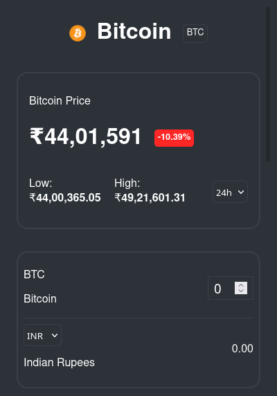

<h1 align="center">
  Crypto Price Tracker
</h1>

<h4 align="center">A Web application to track prices of Cryptocurrencies</h4>


<p align="center">
	<a href="#key-features">Key Features</a> •
  	<a href="#how-to-setup">How To Setup</a>
	<br/>
</p>

## Key Features
- Login page which takes in predefined credentials (Username: test, password: test) and logs the user in 

`Route: /`


- A list of 30 cryptocurrencies sorted according to their market cap 

`Route: /list`


- Search bar to search for a particular cryptocurrency by its name

- When clicked on a row, it takes us to a detailed page about that particular cryptocurrency 
	- This page consists of various Market data like Volume, Market Cap, etc. for that particular coin
	- It also has a calculator which takes in coin value and converts it into User selected currency
	- A chart is displayed which shows the price change in the past 30 days
	- The highest and lowest value is shown according to user selected timeframe

`Route: /coin/:coinID`


- All pages are responsive to devices like Mobile, Tablet and Desktop




## How to Setup
To clone and run this application, you'll need [Git](https://git-scm.com) and [Node.js](https://nodejs.org/en/download/) (which comes with [npm](http://npmjs.com)) installed on your computer. From your command line type:

```bash
# Clone this repository
$ git clone https://github.com/vigneshrajj/crypto-tracker

# Install dependencies
$ npm install

# Run the app
$ npm run dev
```
